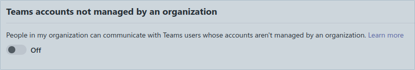

# TeamsEnum

User enumeration of Microsoft Teams users. TeamsEnum is a Python script that allows to find existing users and their online status.

It supports multiple authentication mechanisms and can be used with personal or corporate accounts.

## User account types

### Corporate accounts

These are accounts that are associated with an Azure Active Directory Tenant.

To enumerate users and their presence status, the following endpoints are used:

- teams.microsoft.com
- presence.teams.microsoft.com

### Personal accounts

These are personal accounts that are not associated with an Azure Active Directory Tenant.
Common examples are consumer accounts belonging to outlook.com, outlook.de or hotmail.com.

To enumerate users and their presence status, the following endpoints are used:

- teams.live.com
- presence.teams.live.com

Password authentication cannot be used for Microsoft Accounts ("MSA" or formerly "LiveID") but only for Work and school accounts (https://github.com/AzureAD/microsoft-authentication-library-for-python/wiki/Username-Password-Authentication).

## Authentication

TeamsEnum requires an authenticated session. Three different authentication mechanisms are available, of which one needs to be selected using the `-a` parameter:

### Password-based authentication

Password-based authentication could be used for all non-personal accounts that don't require MFA.

If not passed via command-line argument -p, the password can be entered interactively, which circumvents information disclosure in history files:

```s
$ python3 teamsenum.py -a password -u <username> -e <target>

[...]
   
[~] Checking account type
[~] Account type is: corporate
[~] Attempting to login with provided credentials
[~] Please enter the password to authenticate:
<password>
```

As stated above, password-based authentication can't be used with personal accounts.

### Device Code authentication flow

This option is suitable if MFA is required or if password-based authentication is not possible. The mechanism is based on the `OAuth 2.0 Device Authorization Grant` (https://www.rfc-editor.org/rfc/rfc8628, https://learn.microsoft.com/en-us/azure/active-directory/develop/v2-oauth2-device-code).

To initiate device code authentication, just provide the -a devicecode parameter and the username:

```s
$ python3 teamsenum.py -a devicecode -u <username> -e <target>

[...]
   
[~] Checking account type
[~] Account type is: personal
[~] To sign in, use a web browser to open the page https://www.microsoft.com/link and enter the code UZZRW3EW to authenticate.
```

Afterwards open the URL within a web browser that has internet access and enter the code:


### Token-based authentication

This method can be used if you already have access tokens available.

Upon authentication both, personal and corporate accounts use a Bearer token (originates from the `Authorization` HTTP header field) to authenticate towards the Teams/Live endpoint.

The Bearer token for corporate accounts is a classic JWT, while the Bearer token for personal accounts is just an encoded binary blob.

While the Bearer token is the only requirement for corporate accounts, all personal accounts also require an additional `X-Skypetoken` HTTP header.

If you want to use token based authentication, the easiest way is to sign into Teams from a web browser and fetch the tokens from the Local Storage view of the developer tools.

```s
$ python3 teamsenum.py -a token -t eyJhbGciOiJSUzI1NiIsImtpZCI6I...tr8i530AJMwI= -e <target>

[...]
   
[~] Starting user enumeration

[-] <target>
```

## Requirements

- python3 >= 3.6
- dependencies within requirements.txt

## Installation

Installation of TeamsEnum is straight forward:

```
git clone https://github.com/sse-secure-systems/TeamsEnum.git
cd TeamsEnum`
pip3 install -r requirements.txt
```

## Usage scenarios

### Find existing users

The most common use case is to try to find existing user accounts, based on a list of email addresses. This list can easily be fed into this script via the -f parameter.

```s
$ python3 teamsenum.py -a password -u <username> -f list.txt
 _______                       ______                       
|__   __|                     |  ____|                      
   | | ___  __ _ _ __ ___  ___| |__   _ __  _   _ _ __ ___  
   | |/ _ \/ _` | '_ ` _ \/ __|  __| | '_ \| | | | '_ ` _ \ 
   | |  __/ (_| | | | | | \__ \ |____| | | | |_| | | | | | |
   |_|\___|\__,_|_| |_| |_|___/______|_| |_|\__,_|_| |_| |_|

   v1.0.0 developed by @_bka_
   SSE | Secure Systems Engineering
   
[~] Checking account type
[~] Account type is: corporate
[~] Attempting to login with provided credentials
[~] Please enter the password to authenticate:

[+] Successfully retrieved access token
[~] Starting user enumeration

[-] user1@domain
[+] user2@domain - User2 | Company (Away, Desktop)
[-] user3@domain
[-] user4@domain
```

As a Teams administrator you might think that blocking external communications would effectively stop user enumeration. It doesn't.


Even if the setting "Block all external domains" is configured, you could still use your corporate user account to distinguish between existing and non-existing users.

There is one caveat though: With external communications being blocked, it's not possible to fetch additional user information like the user principal name, display name, presence information etc.

```s
$ python3 teamsenum.py -a password -u <username> -f list.txt
 _______                       ______                       
|__   __|                     |  ____|                      
   | | ___  __ _ _ __ ___  ___| |__   _ __  _   _ _ __ ___  
   | |/ _ \/ _` | '_ ` _ \/ __|  __| | '_ \| | | | '_ ` _ \ 
   | |  __/ (_| | | | | | \__ \ |____| | | | |_| | | | | | |
   |_|\___|\__,_|_| |_| |_|___/______|_| |_|\__,_|_| |_| |_|

   v1.0.0 developed by @_bka_
   SSE | Secure Systems Engineering
   
[~] Checking account type
[~] Account type is: corporate
[~] Attempting to login with provided credentials
[~] Please enter the password to authenticate:

[+] Successfully retrieved access token
[~] Starting user enumeration

[+] user5@domain2 - User exists, but Tenant disallows external communication
[-] user6@domain2
```

There is another caveat affecting the efficiency of user enumeration: When you use a personal user account for enumeration, it is not possible to distinguish between non-existing users and users whose organization blocked external communication. Both will show up as negative results.

Besides the setting mentioned above, there is another setting limiting communication to accounts not managed by an organization:



This has an effect on personal accounts that you use for enumeration.

In fact organizations might block communication to external domains but allow communication to personal accounts, or vice versa.

So if you are not sure if the organization blocks your account, it might make sense to switch from a corporate account to a personal one, or from a personal account to a corporate one.

### Obtain detailed presence and user information

Although the standard output doesn't show a lot of details about the identified users, it's possible to write all interesting details to disk, by using the `-o` parameter. It stores user and presence information in JSON format to make it easier for post-processing e.g. via jq.

After appending the outfile parameter to the script, you could use jq to pretty-print the result file:

```json
$ jq . outfile.json

{
  "email": "user@domain",
  "exists": true,
  "info": [
    {
      "tenantId": "[REDACTED]",
      "isShortProfile": false,
      "accountEnabled": true,
      "featureSettings": {
        "coExistenceMode": "TeamsOnly"
      },
      "userPrincipalName": "user@domain",
      "givenName": "user@domain",
      "surname": "",
      "email": "user@domain",
      "tenantName": "Company",
      "displayName": "User",
      "type": "Federated",
      "mri": "8:orgid:[REDACTED]",
      "objectId": "[REDACTED]"
    }
  ],
  "presence": [
    {
      "mri": "8:orgid:[REDACTED]",
      "presence": {
        "sourceNetwork": "Federated",
        "calendarData": {
          "outOfOfficeNote": {
            "message": "Dear sender. I am out of the office until March 23rd with limited access to my email. I will respond after my return.Kind regards, User",
            "publishTime": "2023-03-15T21:44:42.0649385Z",
            "expiry": "2023-04-05T14:00:00Z"
          },
          "isOutOfOffice": true
        },
        "capabilities": [
          "Audio",
          "Video"
        ],
        "availability": "Away",
        "activity": "Away",
        "deviceType": "Mobile"
      },
      "etagMatch": false,
      "etag": "[REDACTED]",
      "status": 20000
    }
  ]
}
```

This example includes a `outOfOfficeNote` that gives insights into the work schedule of that user.

Please note that if you use personal accounts for enumeration you probably won't get meaningful results when querying the presence API. This is because personal accounts wouldn't see the presence of other user accounts unless there has been an established bi-directional communication beforehand.

So if you rely on presence information you should use corporate accounts for authentication.

## Limitations

Currently password-based authentication was not tested for federated logins (e.g. ADFS). If your corporate account uses ADFS or similar, please use the device code login instead. If you have access to an account with ADFS feel free to test password-based login with your credentials. If any errors occur, please open an issue in this repo.
